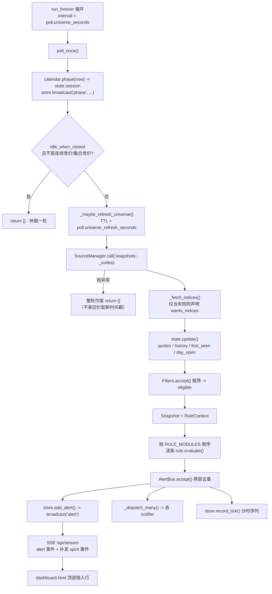

# 架构

本文是代码地图：**一轮引擎从抓行情到上屏，中间经过了哪些模块、哪些函数、为什么这么切**。
面向接手维护的人，不是使用说明。跑法看 `README.md`，字段契约看 `docs/DATA_CONTRACT.md`，
各模块作者的实现记录看 `docs/NOTES_*.md`。

约定：模块 `snake_case`、类 `PascalCase`；`src/` 下除 `config.py` 里那一句 `import yaml`
外，运行时只用标准库。

---

## 1. 进程全景

进程里只有一个线程做业务：引擎主循环。Web 服务（`ThreadingHTTPServer`）在另一个线程读
`AlertStore`，规则因此**不需要考虑并发**——`Engine.poll_once` 是单线程串行调用的。

### 1.1 两个 `run_forever`

`src/arad/engine.py` 里有两个同名函数，别搞混：

| 名字 | 位置 | 职责 |
|---|---|---|
| `Engine.run_forever(self, *, max_rounds=None, on_round=None, watch_only=False)` | `engine.py:741` | **真正的主循环**：按 `poll.universe_seconds`（默认 5s）反复调 `poll_once()`，扣掉本轮耗时后睡剩余时间（以 0.2s 为粒度切片，保证 `stop()` 能及时生效） |
| `run_forever(*, settings=None, source=None, use_web=True, watch_only=False)` | `engine.py:856` | 便捷入口：建 `Engine` → `server.web.serve(engine.store, st.web, block=False)` 起看板 → 调上面那个方法 → `finally` 里 `shutdown()` + `server_close()` |

`watch_only=True` 时把间隔换成 `poll.watchlist_seconds`（默认 3s），并把 `self._codes = list(self.watchlist)`
——`_codes` 的 setter 会同时置 `_codes_pinned=True`，于是**再也不会联网刷新股票池**。这是"我就盯自己那 10 只"
的用法，启动即用，不必等 20 秒的全市场刷新。

### 1.2 一轮 `poll_once` 的时序



几个容易踩的点：

* `store.broadcast("phase", ...)` 在**休眠判断之前**（`engine.py:589`）。所以休市期间虽然没有行情，
  看板仍然能收到时段变化事件。
* 行情抓取失败时**整轮作废**（`engine.py:604-612`）：`state.quotes` 里还留着上一轮的价格，
  继续跑规则等于拿旧价配新时间戳，会产出无中生有的告警。
* 指数单独抓、单独 `state.update`（`engine.py:617-623`），并且**不进 `snap.quotes`**——
  `Snapshot` 是"个股快照"。`spirit_index` 自己去 `ctx.state.quotes` 里捞（见其模块文档）。
  抓指数失败只记 warning，不影响个股主链路。
* 只有**真的有规则要指数**时才发请求：`Engine._wants_indices` 问每条规则有没有
  `wants_indices=True`（当前只有 `SpiritIndexRule` 声明了它），否则 `poll.index_codes` 配了也不抓。
* `state.prune(keep)` 有门槛（`len(history) > len(keep) * 2` 才做），且 `keep` 必须包含
  `watchlist` 和 `index_codes`——否则刚从零攒起来的指数窗口会被清空，拉升指数永远等不到样本。

### 1.3 交易日的七个时段

`src/arad/session.py`，边界**全部左闭右开**（`TradingCalendar.phase`）：

| `SessionPhase` | 值 | 时间 | 引擎行为 |
|---|---|---|---|
| `CLOSED` | `closed` | 非交易日 / 09:15 前 | 休眠 |
| `PRE_OPEN` | `pre_open` | 09:15–09:25 | **照抓**（撮合中价格在动） |
| `AUCTION` | `auction` | 09:25–09:30 | **不抓**——可撤单不可成交，价格不动 |
| `MORNING` | `morning` | 09:30–11:30 | 正常告警 |
| `LUNCH` | `lunch` | 11:30–13:00 | 休眠 |
| `AFTERNOON` | `afternoon` | 13:00–15:00 | 正常告警 |
| `POST` | `post` | 15:00 之后 | 休眠 |

> 历史命名陷阱：成员名 `PRE_OPEN` 是**集合竞价**（09:15–09:25），`AUCTION` 是**静默**（09:25–09:30），
> 名字和值与直觉相反。值和名都是既有契约（会进 JSON、被规则引用），故不改动，但提供了语义正确的
> 别名 `CALL_AUCTION` / `SILENCE`，以及中文表 `PHASE_CN` 供展示层用。连续竞价集合是 `CONTINUOUS`。

规则默认只在 `CONTINUOUS` 里告警（各规则的 `only_continuous`），例外是引擎层的抓取：
集合竞价时段也抓，因为竞价撮合中价格确实在动。

### 1.4 股票池从哪来、怎么刷新

1. 构造 `Engine` 时 `_universe_refreshed_at = 0.0`、`_codes_pinned = False`。
2. `poll_once` 每轮调 `_maybe_refresh_universe()`，超过 TTL（`poll.universe_refresh_seconds`，默认 1800s）
   才刷新；`_codes` 为空时无条件刷。
3. `refresh_universe()` 按 `sources.universe` 的顺序依次尝试 `_universe_sources()`，
   **任一来源返回非空就采用**；全失败则**保留原股票池**（绝不清空——清空会让引擎彻底停摆）并打 warning。
4. 拿到代码后写 `_codes_raw` 而**不是** `_codes`：后者走 setter 会 pin 住，TTL 到期就再也不会刷新。
5. 一个也拿不到时降级为"只监控自选股"并明确打 warning（`engine.py:570-575`），
   因为 `_codes` 为空会让 `poll_once` 直接 return，系统静默地什么都不做。

`_record_universe()` 顺带把 `Quote.list_date` 灌进 `filters.list_dates` 做次新股过滤。
只有东财提供 `list_date`；走新浪那条链路时该字段是空串，`Filters._too_new` 对空值**一律放行**
（不误杀，但也等于当轮新股过滤失效）。

---

## 2. 模块地图

| 模块 | 职责 | 关键名字 |
|---|---|---|
| `src/arad/__init__.py` | 包版本 | `__version__` |
| `models.py` | 核心数据结构与派生量 | `Board` / `AlertKind` / `Quote` / `Snapshot` / `Alert`；`board_of` / `guess_prefix` / `limit_rate_of` / `looks_like_index`；`LIMIT_RATE` / `INDEX_CODES` |
| `config.py` | **唯一**配置入口（不许别处 `yaml.safe_load`） | `PROJECT_ROOT` / `DEFAULTS` / `Settings` / `load_settings` / `load_watchlist` / `load_ignore` / `load_focus` / `load_holidays` / `source_cfg` / `rule_cfg` / `clear_cache` |
| `session.py` | 时段与交易日 | `SessionPhase` / `PHASE_CN` / `CONTINUOUS` / `TradingCalendar`（`phase` / `is_open` / `elapsed_trading_seconds` / `minutes_to_close` / `next_open` / `describe`） |
| `filters.py` | 进规则前的粗筛 | `Filters.from_cfg` / `Filters.accept` / `Filters._too_new` |
| `engine.py` | 主循环、状态、去重、规则/通知器装载、数据源工厂 | `EngineState` / `AlertBus` / `SourceManager` / `Engine` / `build_rules` / `build_notifiers` / `build_source` / `build_source_chain` / `run_forever`；`RULE_MODULES` / `NOTIFIER_MODULES` / `NOTIFIER_MAP` / `SOURCE_MODULES` |
| `store.py` | 引擎与 Web 之间**唯一**的数据通道 | `AlertStore`（`add_alert` / `broadcast` / `subscribe` / `status` / `top_quotes` / `recent_alerts` / `ack` / `record_tick` / `set_poll_stats` / `series` / `snapshot_payload`）；`_SORTS` |
| `spirit.py` | 短线精灵展示层 | `Signal` / `SIGNALS` / `BY_CN` / `KIND_FALLBACK` / `UP` `DOWN` `NEUTRAL`；`signal_of` / `describe` / `direction_of` / `group_of` / `fmt_line` / `to_feed_item` / `_finite` |
| `replay.py` | 离线回放（合成行情驱动**真实**引擎） | `SimClock` / `ReplayQuoteSource` / `ScriptedStock` / `trading_timeline` / `build_script` / `generate_script` / `default_universe` / `Replay` / `ReplayResult`；`TICK_SECONDS` / `KIND_*` / `KIND_CN` |
| `cli.py` | 命令行入口 | `main` / `build_parser` / `cmd_check` / `cmd_once` / `cmd_serve` / `cmd_replay` / `cmd_selftest` / `_setup_stdout` |
| `rules/base.py` | 规则协议与共享上下文 | `Rule` / `RuleContext`（`now_epoch` / `opt`）/ `clamp` / `bucket_of` / `fmt_pct` |
| `rules/tick_surge.py` | 急拉 / 急跌 | `TickSurgeRule` / `DEFAULT_CFG` / `_scan` / `_make_alert` / `_covered` |
| `rules/limit_board.py` | 触板 / 封板 / 炸板状态机 | `LimitBoardRule` / `DEFAULT_CFG` / `_check_side` / `_make_seal` / `_make_touch` / `_check_break` / `_seal_amount_wan` |
| `rules/volume_burst.py` | 放量异动 | `VolumeBurstRule` / `DEFAULTS` / `evaluate` |
| `rules/unusual.py` | 形态类异动 | `UnusualRule` / `PATTERNS` / `PATTERN_CN` / `_edge` / `_check_reseal` / `_mk` |
| `rules/spirit_price.py` | 火箭发射 / 快速反弹 / 高台跳水 / 加速下跌 | `SpiritPriceRule` / `SIGNALS` / `DEFAULTS` / `_sig_rocket` / `_sig_rebound` / `_sig_dive` / `_sig_accel_down` |
| `rules/spirit_order.py` | 盘口 / 委托类 8 信号 | `SpiritOrderRule` / `PATTERNS`(`=SIGNALS`) / `PATTERN_CN` / `_SEV_OF` / `_RANK_OF` / `_scan` / `_check_trades` / `_check_orders` / `_mk` / `_materialize` |
| `rules/spirit_index.py` | 拉升指数 / 打压指数 | `SpiritIndexRule`（`wants_indices = True`）/ `SIGNALS` / `SIGNAL_CN` / `is_index_quote` / `_evaluate_one` / `_mk` |
| `sources/base.py` | 数据源协议 | `Source`（`universe` / `snapshots` / `health`）/ `SourceError` |
| `sources/tencent.py` | 主行情通道 | `TencentSource` / `parse_response` / `decode_body` / `normalize_code` / `split_prefix` / `FIELD_INDEX` / `build` / `default_fetcher` |
| `sources/eastmoney.py` | 股票池首选 | `EastmoneySource` / `parse_clist` / `parse_ulist` / `secid_of` / `CLIST_URL` / `ULIST_URL` / `PAGE_LIMIT=100` / `BULK_LIMIT=50` |
| `sources/sina.py` | 兜底行情 + 股票池兜底 | `SinaSource` / `parse_response` / `parse_universe` / `UNIVERSE_URL` / `UNIVERSE_PAGE_SIZE=100` / `UNIVERSE_MAX_PAGES=80` |
| `notifiers/base.py` | 通知器协议 | `Notifier`（`send` / `send_digest`，**约定绝不抛异常**） |
| `notifiers/console.py` | 控制台播报（带色） | `ConsoleNotifier` / `KIND_STYLES` / `enable_vt` / `paint` / `_fit` / `_disp_width` |
| `notifiers/file_jsonl.py` | JSONL 落盘 | `FileJsonlNotifier` / `path_locks` / `_resolve_path` |
| `notifiers/webhook.py` | HTTP POST，**其余通知器的共用底座** | `WebhookNotifier` / `default_poster` / `post_with_retry` / `format_url` / `resolve_dry_run` / `severity_of` / `kind_label` / `alert_values` / `alert_payload` |
| `notifiers/dingtalk.py` | 钉钉（支持加签） | `DingTalkNotifier` / `sign` / `sign_params` / `signed_url` |
| `notifiers/feishu.py` `serverchan.py` `windows_toast.py` | 飞书 / Server酱 / Windows 弹窗 | `FeishuNotifier` / `ServerChanNotifier` / `WindowsToastNotifier`（`_default_runner` / `ps_quote` / `_xml_escape`） |
| `server/web.py` | HTTP + SSE 服务 | `DashboardHandler` / `RadarHTTPServer` / `create_server` / `serve` / `build_config` / `NullStore` / `feed_item_of` / `spirit_groups` / `resolve_sort` / `dumps_json` / `scrub_non_finite` / `load_dashboard_html`；`_GET_ROUTES` / `_POST_ROUTES` / `WEB_DEFAULTS` / `MAX_*_LIMIT` |
| `server/dashboard.html` | 单文件看板（内联 CSS/JS，零外链、零构建） | JS：`spiritRow` / `pushSpirit` / `insertSpiritNode` / `rerenderSpirit` / `renderSpiritFilters` / `loadSpirit` / `connect` / `onTick` / `onAlert` / `refreshAll` |

`rules/__init__.py`、`sources/__init__.py`、`notifiers/__init__.py`、`server/__init__.py` 都只有一行
`"""package."""`；规则与通知器的注册**不在包 `__init__` 里**，而是引擎按配置里的名字
`importlib.import_module(f".rules.{name}", package="arad")` 动态装载。

---

## 3. 两层去重的设计

去重只在**一个地方**做：`AlertBus.accept(alert, now_epoch)`（`engine.py:167`）。规则自己不做跨轮去重。

### 3.1 第一层：`key` 里的时间桶

`Alert.key` 形如 `f"{code}:{kind.value}:{bucket}"`，`bucket` 由 `rules/base.py` 的
`bucket_of(now_epoch, cooldown_seconds)` 给出：

```python
def bucket_of(now_epoch: float, cooldown_seconds: float) -> int:
    cd = max(float(cooldown_seconds), 1.0)
    return int(now_epoch // cd)
```

同 `key` 在 `AlertBus.window_seconds`（默认 3600s）内只放行一次。

### 3.2 第二层：`cooldown_key` + `cooldown_seconds`

```python
cd = float(getattr(alert, "cooldown_seconds", 0.0) or 0.0)
ck = getattr(alert, "cooldown_key", "") or ""
if cd > 0.0 and ck:
    last = self.state.last_cooldown.get(ck)
    if last is not None and (now_epoch - last) < cd:
        return False
    self.state.last_cooldown[ck] = now_epoch
```

**为什么必须有第二层**：`bucket` 是 `now_epoch // cooldown`，桶边界落在**固定墙上时钟网格**上。
于是"桶 5965080 的最后一秒"和"桶 5965081 的第一秒"虽然只差 1 秒，`key` 却不同，第一层完全失效。
`Alert.cooldown_key` 的字段注释（`models.py:335-344`）记着实测后果：配置 `cooldown=300`，
两条急拉告警只隔了 **11 秒**。

第二层的 `cooldown_key` 是**不含时间桶的稳定身份**（例如 `f"{code}:{kind.value}"`），
`cooldown_seconds` 是真实经过时间。两者都在 `Alert` 上（`models.py:337` / `models.py:344`），
由规则在 `_mk` / `_make_alert` 里填写——**每条声明了冷却的告警都必须填，否则只有第一层保护**。

已填写的规则：`tick_surge`（`f"{code}:{kind}"`）、`volume_burst`（`f"{code}:{kind}"`）、
`unusual` / `spirit_price` / `spirit_order` / `spirit_index`（都带 `pattern` 分段）。

### 3.3 事件型 vs 状态型

第二层解决的是**桶边界**问题。还有第三个问题得靠**状态机**解决：分桶 key 每个冷却窗口就变一次，
所以一个**持续存在的状态**会被反复重报——一只票封板两小时，每 5 分钟刷一条一模一样的告警。
这就是事件型与状态型的分野。

| 类型 | 判定口径 | 参考实现 |
|---|---|---|
| **事件型** | 发生即报。分桶 `key` + `cooldown_key` 足够 | `tick_surge`（急拉急跌）、`volume_burst`、`spirit_price` 四信号、`spirit_order` 的成交类 |
| **状态型** | **只在状态跃迁时报一次**，状态不变时一个告警都不产 | `limit_board._check_side` 状态机、`spirit_order._edge`、`unusual._edge` |

`limit_board` 是状态型的参考实现，状态机每只股票每个方向独立，按自然日清空：

```text
away ──触限价──► sealed ──跌离──► broken ──回落到位──► broken（已报，不重播）
  ▲                 │                │
  └─────回落──── near ◄──────────────┘
```

细节：`prev == "sealed"` 且仍在限价上 → `return None`（状态没变）；重新封回会把状态置回 `sealed`，
所以"快速回封后再炸板"能再报一次。跌停侧只识别"封跌停"——**撬板（跌停被打开）不属于本规则口径**，
直接放过，但状态必须复位为 `away`，否则"封跌停 → 撬开 → 再封跌停"就不会再报（状态机卡住）。

`unusual._edge` / `spirit_order._edge` 是同一套思路的轻量版：`on` 是进入形态的条件，`off` 是
"已明确恢复"的条件，两者之间留迟滞，避免数值在阈值附近抖动导致反复上报；`off` 恒为 `False`
表示该形态当天不会恢复（例如振幅单调不减的巨震），因此一天只报一次。

### 3.4 `key` 格式：信号名必须在 key 里

契约要求 `key` 形如 `f"{code}:{kind.value}:{bucket}"`，但**光有 `code:kind` 是不够的**。
多个信号常常共用一个 `AlertKind`：

* `spirit_order` 的 8 个信号全部是 `AlertKind.UNUSUAL`；
* `unusual` 的 5 个 pattern 全是 `AlertKind.UNUSUAL`；
* `spirit_price` 的 4 个信号共用 `SURGE` / `PLUNGE`（但彼此之间语义互斥）。

如果 `key` 停在 `f"{code}:{kind.value}:{bucket}"`，同一只票同一桶内**不同信号会撞 key 互相吞掉**。
所以这几条规则一律把 `pattern` 插进 key 的中段：

```python
key=f"{code}:{_KIND.value}:{pattern}:{self._bucket}"     # spirit_order._materialize
key=f"{code}:{_KIND.value}:{pattern}:{bucket}"           # unusual._mk / spirit_price._mk / spirit_index._mk
```

`limit_board` 更进一步，在 `kind` 之后插**阶段名**：`seal` / `touch` / `break`
（`key=f"{q.code}:{kind.value}:seal:{bucket}"` 等），因为同一只票同一轮可能同时产出
"曾涨停后炸板"和"现封跌停"两个方向的告警，天地板两个方向是独立事件，**不能先到先得互相遮蔽**。

对应地，`cooldown_key` 也要带 `pattern` 分段（`f"{code}:{kind}:{pattern}"`），否则封涨停和
触涨停会共用一条冷却记录。

---

## 4. 数据源抽象与降级

### 4.1 协议与错误契约

`sources/base.py`：

```python
class SourceError(RuntimeError):
    """数据源故障（网络/解析/限频）。引擎捕获后触发故障转移。"""

@runtime_checkable
class Source(Protocol):
    name: str
    def universe(self) -> list[Quote]: ...
    def snapshots(self, codes: list[str]) -> list[Quote]: ...   # 6 位码，不带前缀
    def health(self) -> dict: ...                               # {'name','ok','latency_ms','err'}
```

`SourceError` 的语义是**"这批数据没拿到"**，不是"这批数据是空的"：

* 空列表意味着"市场里没有股票"，会让引擎静默退化 → 所以拿不到就**抛错**，由故障转移接手；
* `snapshots()` 任一批次失败即抛（目标是"这批指定代码"，缺一批不能算成功）；
* 两个源都只返回**被请求的代码**，过滤掉服务端回带的额外行，避免调用方按 code 取值时被意外覆盖。

### 4.2 行情通道的故障转移：`SourceManager`

`build_source_chain(settings)` 按 `sources.primary` + `sources.fallback` 构造源列表，
包进 `SourceManager`。`SourceManager.call(method, *args)` 的语义：

* 对每个源**只尝试一次**（重试在源内部自己做，退避 `0.3 / 0.9 / 2.0` 秒）；
* 主源失败、备用源成功 → 本次返回备用源数据（热备），并累加失败计数；
* 连续失败达到 `sources.failover_threshold`（默认 3）→ 把该备用源**正式提升为主源**；
* 全部失败 → 抛最后一个异常，`poll_once` 整轮作废。

`health()` 会把当前生效的源标上 `active: true`，看板顶栏的数据源指示灯读的就是它。

### 4.3 股票池的降级链

`sources.universe` 是**可以为列表**的：

```yaml
sources:
  universe: ["eastmoney", "sina"]
```

`Engine._universe_sources()` 按顺序构造专用源（懒构造，缓存在 `_universe_src`），
`refresh_universe()` 逐个尝试，**任一来源返回非空就采用**。列表的意义：

> 东财对部分网络/IP 会 `RemoteDisconnected` 限流。只配 `"eastmoney"` 单个来源时，
> 东财一被限流整轮股票池刷新就报废，系统**静默**退化成只盯自选股那 10 只——
> 日志之外看不出异常，盘中基本没用。配成列表后会自动退到新浪**行情中心**
> （`Market_Center.getHQNodeData`，`node=hs_a`），实测能列全 5563 只。

专用源全都构造失败时退回主源链（`[self.sources]`），保证至少还能用自选股跑起来。

### 4.4 东财限流是常态，不是故障

`push2.eastmoney.com` 的 **clist** 接口从部分网络会被 IP 限流，表现为
`RemoteDisconnected: Remote end closed connection without response`，约 95–105ms 快速失败。
此时**走新浪是正常路径**——`tools/probe_live_ready.py` 与 `tools/live_session.py` 的实测都是
"东财失败 → 自动退到新浪 → 拿到 5563 只"。日志里那条 `WARNING arad.engine: 股票池来源 eastmoney 失败`
是预期噪声，不是故障信号。真正要报警的是**所有**股票池来源都失败，那时引擎会打
"所有股票池来源都失败，保留原股票池"并沿用上一份代码列表。

### 4.5 仓库里已记录的数字

| 指标 | 值 | 出处 |
|---|---|---|
| 腾讯批量 | 5913 码 / 8 批（每批 800）/ 2.13s；硬上限 800，配置保守 600 | `docs/DATA_CONTRACT.md` §2.1 |
| 东财 clist 股票池 | `total=5913`，`pz` 被服务端硬限为 100，需翻 60 页；8 线程约 1.42s | `docs/DATA_CONTRACT.md` §2.2 |
| 东财批量快照 | 5 码可用，**800 码返回 HTTP 502**（URL 过长）→ 每批 ≤50 码 | `docs/DATA_CONTRACT.md` §2.2 |
| 新浪 `hq.sinajs.cn` | 800 码 / 310ms | `docs/DATA_CONTRACT.md` §2.3 |
| 新浪行情中心股票池 | 5563 只 / 56 页（`num=100`）/ 约 19s | `docs/NOTES_eastmoney_sina.md` §6.1 |
| 全市场股票池（东财失败转新浪） | 5563 只 / 18.7s | `README.md` |
| 单轮扫描（5563 只，7 规则全开） | p50 **949 ms** / max 1082 ms | `README.md` |
| 其中纯 CPU | **24 ms**（其余是网络） | `README.md` |
| 5 秒轮询预算余量 | **5.3×** | `README.md` |
| 同上，另一次 `--live --repeat 5` | p50 1069 ms / max 1135 ms / 余量 4.7× | `data/bench_round_20260917_080314.json` |
| 纯 CPU（`--offline`，5563 只） | p50 23.5 ms，每只 0.0042 ms | `data/bench_round_20260917_074412.json` |
| 规模线性度 | 500 → 5563 只，每只成本 0.0037 → 0.0042 ms（≈线性） | 同上 |
| 五档 / 内外盘 / 流通股本可用率 | 800/800 · 799/800 · 800/800 | `README.md` |
| CPU 被占满时 | p95 **5991 ms**（超预算）；机器空闲后重测 949 ms | `README.md`、`tools/bench_round.py` docstring |

**性能数字必须连机器负载一起说。** 上表最后一行是硬约束：同一套代码同一台机器，
CPU 饱和时单轮从约 1s 膨胀到约 6s。任何"撑得住 / 撑不住"的结论，前提都是当时机器空闲。

---

## 5. 短线精灵展示层（`src/arad/spirit.py`）

这一层只做**翻译**：把各规则产出的 `Alert` 翻成同花顺/大智慧短线精灵那样的逐条播报行。
它不判行情、不碰网络，是控制台、Web 看板、JSON 导出**共用的一份**信号表。

### 5.1 33 个信号，5 个分组

`SIGNALS: dict[str, Signal]`，`Signal` 有 `name / cn / direction / group / hint` 五个字段
（`__slots__`）。分组计数（`spirit_groups()` 从这张表实时推导，前端不硬编码）：

| `group` | 数量 | 信号 |
|---|---|---|
| `price` 价格异动 | 6 | `rocket` `rebound` `dive` `accel_down` `surge` `plunge` |
| `order` 盘口委托 | 8 | `big_buy` `big_sell` `institution_buy` `institution_sell` `institution_eat` `institution_vomit` `big_bid_wall` `big_ask_wall` |
| `limit` 涨跌停 | 11 | `limit_up_seal` `limit_down_seal` `open_limit_up` `open_limit_down` `limit_up_touch` `limit_down_touch` `limit_up` `limit_down` `seal` `break` `touch` |
| `index` 指数 | 2 | `index_pull` `index_press` |
| `pattern` 形态 | 6 | `high_open_fade` `low_open_rise` `wide_amplitude` `late_surge` `reseal` `volume_burst` |

合计 **33**。`web.SPIRIT_GROUP_CN` 另有一项 `other`（"其它"），`SPIRIT_GROUP_ORDER` 把它排在最后
——它是给 `describe()` 对**未注册信号名**的兜底分组（`Signal(name, name, NEUTRAL, "other")`）用的。
注意 `spirit_groups()` 只输出注册表里**真实存在**的 group（实测返回上表 5 个，不含 `other`），
所以未注册信号只会出现在"全部"页签下，不会凭空多出一个按钮。

`limit` 组里的 `seal` / `break` / `touch` 是**阶段短名**。它们是 `limit_board` 状态机的三个阶段
（`_make_seal` / `_check_break` / `_make_touch`），出现在 `key` 的中段分段里
（`f"{q.code}:{kind.value}:seal:{bucket}"`），而不是写进 `metrics["pattern"]`——
后者用的是 `limit_up_seal` / `limit_down_seal` / `limit_up_touch` / `limit_down_touch` / `open_limit_up`
这些**带方向的细分名**（`limit_board._make_seal` / `_make_touch` / `_check_break`）。

注册表 33 个名字里，**31 个**在规则代码里以字符串字面量出现（含 `KIND_FALLBACK` 的 6 个目标）；
`open_limit_down` 与 `touch` 目前**只作为注册表条目存在**：
`limit_board` 的跌停侧不做撬板口径（见 §3.3），而触板走的是 `limit_up_touch` / `limit_down_touch`。
它们留在表里是为了语义完整——上游一旦补上撬板口径，展示层不用改。

各规则往 `metrics["pattern"]` 里写的名字有：`limit_board`（封板/触板/炸板）、
`unusual` 的 5 个 pattern、`spirit_price` 的 4 个信号、`spirit_order` 的 8 个信号、
`spirit_index` 的 2 个信号，加上 `tick_surge` / `volume_burst` 走 `KIND_FALLBACK`
（`surge` / `plunge` / `volume_burst`）。

### 5.2 方向模型与配色

```python
UP = "up"          # 偏多（红）
DOWN = "down"      # 偏空（绿）
NEUTRAL = "flat"   # 中性（灰）
```

A 股是**红涨绿跌**，所以 `up` → 红、`down` → 绿、`flat` → 灰。方向是 `Signal` 的静态属性，
不是从涨跌幅算出来的——这是关键：**信号方向 ≠ 当日涨跌方向**。

最容易搞反的两个：

| 信号 | 中文 | 方向 | 颜色 | 为什么 |
|---|---|---|---|---|
| `open_limit_up` | 打开涨停 | **`DOWN`** | **绿** | 涨停封单被砸开 = **卖压赢了**，是利空 |
| `open_limit_down` | 打开跌停 | **`UP`** | **红** | 跌停封单被撬开 = **买盘赢了**，是利好 |

语义理由：封涨停是买盘把价格顶到上限并挂出巨量封单；一旦"打开"，说明卖盘把封单吃穿了，
主动权换手——所以是**看空**信号。反过来，跌停被打开说明有人在跌停价上大举接货，
把压单全部吃掉——所以是**看多**信号。直觉上"打开涨停 = 涨停了，红"是错的：涨停**已经**发生了，
这条播报讲的是它**没能守住**。

推论：`up`/`down` 行**不保证**涨跌幅符号一致。快速反弹、打开跌停这类信号，本身就是
"一只当日下跌的票出现了看多事件"，红色行配 `-1.50%` 完全正确。真正该守的是**涨跌幅带正负号**
（颜色之外的第二载体，色盲可用性靠它），`dashboard.html` 的 `signed()` 负责这件事。

展示层与配色的一致性有测试和真浏览器审计双重看守：`tools/check_colors.py` 逐个核对 10 个信号，
`tools/audit_dashboard_visual.py` 核对 12 个，都包含这两个最易搞反的。

### 5.3 取信号名：`signal_of` → `describe`

```python
def signal_of(alert) -> str:
    # 优先 metrics["pattern"]，其次 metrics["signal"]，最后退回 AlertKind
```

各规则都往 `metrics["pattern"]` 里放细分信号名（`limit_board._make_seal` / `_make_touch` /
`_check_break`、`unusual._mk`、`spirit_price._mk`、`spirit_order._materialize`、`spirit_index._mk`）。
`KIND_FALLBACK` 把 `AlertKind` 映射到兜底信号名（`SURGE→surge`、`UNUSUAL→wide_amplitude` 等）。

`describe(alert)` 取 `Signal`；**注册表里没有的信号名原样返回、中性配色**（`Signal(name, name, NEUTRAL, "other")`）
——不硬塞进某个分类，保证看板不会崩也不会误导。

`tools/check_spirit_mapping.py` 回答"规则产出的 pattern，展示层是否都认识"，穷举核对后输出
`缺失: 无`；漏一个的后果是静默降级成兜底名（"机构吃货"被显示成"异动"）。

### 5.4 `to_feed_item`：给前端的最小结构

```python
def to_feed_item(alert) -> dict:
    return {"key", "ts", "epoch", "code", "name", "signal", "cn",
            "dir", "group", "hint", "price", "pct", "severity", "title", "extra"}
```

只带看板真正要显示的字段——短线精灵一屏几十条，字段多了传输和渲染都吃不消。
`extra` 只挑盘口类的关键数字（`amount` / `volume_ratio` / `turnover` / `seal_amount_wan` /
`window_pct` / `amplitude` / `ratio_vs_float`），鼠标悬停时展示。

注意方向键叫 **`dir`**（前端 `spiritRow` 读 `a.dir`），不是 `direction`。

`web.feed_item_of(raw)` 负责把 `store.recent_alerts()` / SSE 推的 **dict** 还原成 `Alert`
再走同一套注册表逻辑（**绝不另写一份映射**）；缺 `key` 或字段坏掉的行返回 `None`，
调用方跳过该行——一条坏数据不能让整页 `/api/spirit` 变 500，也不能毒死整条 SSE 连接。

### 5.5 `_finite`：非有限值不许出网

```python
def _finite(v, default=0.0) -> float:
    try:
        f = float(v)
    except (TypeError, ValueError):
        return default
    return f if math.isfinite(f) else default
```

`to_feed_item` 里**每个数值字段都过一遍它**（含 `epoch`、`price`、`pct`、`extra` 的每一项；
`severity` 另做一次 `isfinite` 检查后取整）。

为什么必须在**出口统一清洗**，而不是指望每个调用方自己小心：
`JSON.parse` 不接受裸的 `NaN` / `Infinity`。一旦漏进 SSE 或 `/api/spirit` 的响应体，
**整个事件流会解析失败并断掉**——看板上表现为"短线精灵突然不动了"，而且服务端没有任何报错。
数据源确实会给出这类值（东财见过 `f2="1e999"` → `inf`），做除法时分母为 0 也会产生 `inf`。
历史上真出过这个问题。

同一件事在三处各有一道防线，是刻意的冗余：

| 位置 | 手段 |
|---|---|
| `models.Alert.to_dict()` | `_num` / `_finite`：非有限浮点转 `None`，字符串/列表原样透传 |
| `spirit.to_feed_item()` | `_finite`：非有限浮点转 `0.0` |
| `server.web.dumps_json()` | 严格模式 `allow_nan=False`，失败后退到 `scrub_non_finite()` 递归把 `NaN`/`±Inf` 换成 `None` |

`tools/probe_nan_safety.py` 用严格模式 `json.loads` 验这三道防线。

---

## 6. Web 看板

### 6.1 单文件，无构建

`src/arad/server/dashboard.html`（1114 行）内联全部 CSS 与 JS，**零外链、无框架、无构建步骤**。
`web.load_dashboard_html()` 按 mtime 缓存读取，读失败返回内置 `_FALLBACK_HTML`——保证 `/` 永远不 500。
布局是三栏 CSS Grid：

```css
.grid{grid-template-columns:minmax(420px,30fr) minmax(520px,44fr) minmax(268px,26fr);}
@media (max-width:1140px){ .grid{grid-template-columns:minmax(360px,42fr) minmax(0,58fr);} }
```

左栏内部再竖着叠两块（`#spiritPanel` 定高 `flex:0 0 306px`，`#alertsPanel` 吃剩下的
`flex:1 1 0`），刻意**不加第四列**——三列 min-width 合计已 1098px，1280px 设计宽度下再加一列会横向溢出。

### 6.2 SSE 流

`GET /api/stream`，`text/event-stream`，`Cache-Control: no-cache`、`X-Accel-Buffering: no`，
首帧 `retry: 3000`。事件名是**透传**的（队列里来什么就发什么），当前有三类：

| 事件 | 何时 | 负载 |
|---|---|---|
| `alert` | `AlertStore.add_alert()` 时广播 | `Alert.to_dict()` 原样 |
| `spirit` | 紧跟在 `alert` 之后**自动补发**（`_expand_queue_item`） | `spirit.to_feed_item()` 的展示形状 |
| `tick` | 每 `web.sse_interval`（默认 2s）心跳 | `{ts, status, quotes, watchlist}` |
| `phase` | `poll_once` 每轮开头广播 | `{phase}` |
| `bye` | 服务端 shutdown 或 `sse_timeout`（默认 3600s）到期 | `{ts, reason}`，发完**正常结束**该连接，浏览器按 `retry` 自动重连 |

前端只监听 `tick` / `alert` / `spirit`（另有 `message` 兜底分支），其余事件由 `EventSource` 自然忽略
——所以引擎新增事件类型不需要改 web 层。补发 `spirit` 事件的意义：让精灵面板拿到就能直接画，
不用在 JS 里重做一遍信号名映射。补发失败绝不影响主事件。

两个必须知道的实现细节：

* **断开检测靠 `recv(1, MSG_PEEK)` 非阻塞探测**（`_peer_gone`），不能只靠写时抛
  `BrokenPipeError`：小 chunk 会先落进 socket 发送缓冲，而浏览器关页后通常没有后续写入，
  结果是订阅队列迟迟不释放。`BlockingIOError` = 连接仍活；`ECONNRESET` / `b""` = 对端已断开。
  配合 `daemon_threads = True` 与 `RadarHTTPServer.stop_event`，shutdown 后所有 SSE 线程主动收尾，
  实测 250ms 内退出、端口释放。
* 订阅队列 `maxsize=200`，满时**丢最旧的一条**，绝不阻塞引擎——行情推送不能被慢客户端拖死。

### 6.3 `/api/*` 端点

路由表在 `web.py:891`（`_GET_ROUTES`）与 `web.py:904`（`_POST_ROUTES`）。路径对但方法不对返回 405，
路径不存在返回 404，任何 handler 异常由 `_safe_handle` 转成 500 JSON。JSON 一律
`ensure_ascii=False` + `application/json; charset=utf-8`。

| 方法 | 路径 | 要点 |
|---|---|---|
| GET | `/` `/index.html` `/dashboard.html` | 同一个 handler，返回内置 HTML |
| GET | `/api/status` | `store.status()` 原样透传（含 `session_desc` / `is_open` / `by_kind` / `subscribers` / `dry_run` 等） |
| GET | `/api/quotes?limit=&sort=` | `limit` clamp 到 200；`sort` 经 `resolve_sort()` 别名映射，响应同时回 `sort`（请求值）与 `sort_key`（实际生效键） |
| GET | `/api/alerts?limit=&kind=` | `limit` clamp 到 1000；`kind` 为 `""`/`all`/`全部` 视为不过滤；`total` 不受 `limit` 截断影响 |
| GET | `/api/spirit?limit=` | `limit` clamp 到 1000，默认 `web.max_spirit=200`；返回 `{items, count, limit, groups, ts}`，`groups` 从注册表实时推导 |
| GET | `/api/watchlist` | 自选股实时行情 |
| GET | `/api/series?code=&limit=` | 单只票的分时序列（mini 图用），`code` 非法返回 400 |
| GET | `/api/health` | 存活探针 `{"ok":true,"ts":...,"service":"arad-dashboard"}` |
| POST | `/api/ack` | 标记已读，`key` 取自 JSON body、query 或表单；缺失返回 400 |

**`sort` 的别名映射是一条防漂移措施**：引擎侧 `store._SORTS` 只认
`speed` / `speed5` / `pct` / `up` / `down` / `amount` / `volume_ratio`，
`store.top_quotes()` 对不认识的键会**静默退化成 `speed`**——表现是"点了排序但没排"，
最难查的一类 bug。所以 web 层显式做 `speed_1m→speed`、`speed_5m→speed5`、
`turnover→amount`、`amplitude→pct`、`price→pct`，未知值一律回落 `speed`，
**绝不把引擎不认识的键透传下去**；测试 `test_resolve_sort_never_passes_unknown_key_to_engine`
import 真实的 `arad.store._SORTS` 做交叉断言。

`NullStore`（`web.py:361`）是没有引擎时单机调试 UI 用的替身：所有读接口返回空/合理默认值，
额外提供 `publish(event, data)` 手动造事件。

### 6.4 DOM 行数上限

前端两个常量（`dashboard.html`）：

```js
var MAX_ALERTS = 300;
var MAX_SPIRIT = 200;   /* 短线精灵 DOM 上限：一屏几十条，长会话也不能无限涨 */
```

两处都做双向裁剪：数组 `splice` 掉最旧的，同时 `removeChild(list.lastChild)`
和 `delete S.seen[key]`（去重表同步清理，否则长会话下它会无界增长）。
补充历史用 `/api/spirit` 与 `/api/alerts`，两者都用 `key` 去重（SSE 断线重连会重放，
重复拉取安全）。不变量：`S.spirit[0]` **永远是最新的一条**（`pushSpirit` 用 `unshift`，
`loadSpirit` 从最旧一条往回插）。

### 6.5 行高 23px 与"6 列对 6 格"

```css
.sp{display:grid;grid-template-columns:46px 52px minmax(0,1fr) 60px 50px 50px;gap:6px;
    align-items:baseline;padding:2px 9px;font-size:11.5px;line-height:1.5;}
```

`spiritRow(a)` 产出 6 个 `<span>`：时间 / 代码 / 名称 / 信号 / 现价 / 涨跌幅。
**列数与格子数必须相等**——`grid-template-columns` 写 5 列而格子有 6 个时，
CSS Grid 会把第 6 个**自动换到第二行**：

| | 出错时 | 正确时 |
|---|---|---|
| 行高 | **46.5px**（两行文字） | 23.2px |
| 一屏可见 | 5 条 | 10 条 |
| 格子 y 偏移 | `[4,4,2,2,3,26]` | `[4,4,2,2,3,3]` |

这个 bug 真的发生过，而且**不报错、测试不红、截图乍看也正常**——它只是让滚动列表的
信息密度腰斩，而信息密度正是短线精灵这东西的全部价值。现在有
`tests/test_dashboard_frontend.py::test_spirit_row_grid_columns_match_rendered_cells`
钉住：从 CSS 里数列数、从 `spiritRow` 里数 `'<span class="`，两者必须相等；
改回 5 列会立刻失败并打印"声明了 5 列，但 spiritRow 产出 6 个格子"。

信号名那一列给**固定 60px** 而不是 `auto`：遇到超长信号名要截断，
不能让 `auto` 撑开把名称列挤没（`.sp>*{overflow:hidden;text-overflow:ellipsis}`）。

同一块面板还有两条同源约束，都有测试：

* `.spfilters` 必须 `flex-wrap:nowrap` + `min-width:0`。只写 `nowrap` 拦不住折行——
  flex 项的 `min-width` 默认是 `auto`（= 内容宽度），根本不允许收缩。折行会把表头从 31px 撑到 53px，
  而面板是定高 306px 的，等于少显示一整条精灵。
* 前景色对比度：`--fg3`（时间戳用）在三个面板底色上必须达到 WCAG AA 的 4.5:1，
  且 `--fg3` 必须比 `--fg2` 暗（否则"次要信息"看起来比主要信息还重）。

---

## 7. 配置

单一入口 `src/arad/config.py`。**任何模块都不许自己 `yaml.safe_load`**，
`Settings.get("poll.universe_seconds")` 走点分路径，`Settings.section("rules")` 取分节。

### 7.1 加载与缓存

```python
_CACHE: dict[str, Any] = {}

def load_settings(path=None, *, use_cache=True) -> Settings: ...
def clear_cache() -> None: ...
```

`load_settings` 把 `DEFAULTS` 与文件做 `_deep_merge`（dict 递归、其余覆盖），
所以旧配置缺字段也能跑。缓存键是文件路径字符串。

**`use_cache=False` 表示"要一份独占副本"——既不读缓存，也不写缓存。**
只跳过读、仍然回写的话，调用方改一改这份"私有"配置就会污染进程内的共享实例。
实测过一次：一个测试改了 `rules.*.enabled`，导致同进程的回放测试全部 0 告警。

需要独占副本的地方：`tools/bench_round.py`、`tools/probe_live_ready.py`、
`tools/live_session.py` 都要把三个 `spirit_*` 模块临时打开，必须绕开缓存。

### 7.2 "孤立键"纪律

`tools/check_orphan_config.py` 把 `settings.yaml` 里所有叶子键的**末段名**收集起来，
再到 `src/` 里搜字符串字面量（三种命中形式：独立键名、点分路径末段、路径中段），
搜不到就列为"可疑的孤立键"。当前结果：

```text
配置叶子键 115 个，源码字符串字面量命中 115 个
✓ 没有可疑的孤立配置键
```

它盯的是这类 bug 的共同特征——**不报错**：用户改了配置，系统照旧按老行为跑。
这套纪律来自两次真实的翻车：

1. `max_per_round: 0`（不限量）被 `merged.get(k, 15) or 15` 悄悄换回 15
   （`tick_surge.__init__` 的注释专门写了这件事，现在是
   `int(15 if _mpr is None else _mpr)`）；
2. `load_settings(use_cache=False)` 仍然回写缓存，污染共享单例。

`tools/check_config_wiring.py` 补上另一半：核对三个 `spirit_*` 节存在且默认 `enabled: false`、
每个模块的 `DEFAULTS` 键都在 YAML 里出现（漏一个就只能靠代码默认值，运维改配置会以为改生效了）、
以及 `max_per_round=0` 是否真的保持不限量——两种风格都要认（存成属性的，和每轮从 `ctx.cfg` 现取的）。

### 7.3 配置里几个反直觉的默认值

| 键 | 默认 | 为什么 |
|---|---|---|
| `app.dry_run` | `true` | 通知只打印不真发，首次运行先观察 |
| `rules.spirit_price` / `spirit_order` / `spirit_index` | `enabled: false` | `spirit_price` 与 `tick_surge` 都在抓"快速上涨"，同开会把同一波行情报两遍；`spirit_order` 的成交信号是快照增量近似，噪声高；`spirit_index` 需要指数管道且大盘指数极易刷屏 |
| `poll.index_codes` | `["sh000001", ...]` | **必须带交易所前缀**。`000001` 既是上证指数（`sh000001`）也是平安银行（`sz000001`），裸码会被 `Engine._load_index_codes()` 丢弃并告警——猜错的代价是"拿到一份看起来正常的错误数据"，比不监控更糟 |
| `filters.exclude_boards` | `["index"]` | 指数不进个股规则的粗筛；`spirit_index` 绕过 `snap.quotes` 自取 |
| `filters.min_list_days` | `11` | 新股无涨跌幅限制，噪声大。上市日期只有东财提供，走新浪时该项自动失效（空值放行，不误杀） |
| `notify.windows_toast.min_severity` | `3` | 多数规则默认 severity 2，所以默认只有 `urgent_multiple` 触发的告警才会弹窗。这是刻意的（托盘通知很吵），但首次联调时容易误判"通知器没工作" |

`rules:` 下每个规则读自己那一节（`Settings.rule(name)` → `rule_cfg()`，会
`setdefault("enabled", True)`）。**注意这个 `setdefault`**：它意味着 YAML 里缺了某一节，
模块 `DEFAULTS` 里的 `enabled: false` 拦不住——`spirit_*` 三节必须显式写 `enabled: false`，
`tools/check_config_wiring.py` 检查的正是这一条。

---

## 8. 测试与验证策略

系统只在连续竞价时段告警，而开发往往在收盘后。所以验证**离线优先**：不依赖开盘、不依赖网络，
用合成行情驱动**真实引擎**。

### 8.1 `selftest`：全链路自检

```bash
python -m arad.cli selftest          # 无告警 / 剧本未命中 -> 非零退出
python -m arad.cli replay --out data/replay_alerts.jsonl
```

`replay.py` 用 `SimClock`（假时钟，可注入 `Engine(now_fn=...)`）+ `ReplayQuoteSource`
（实现 `Source` 协议，每轮 `snapshots()` 取当前帧并推进指针）驱动真实的 `Engine.poll_once`。
时间轴 `trading_timeline()` 按 `TICK_SECONDS = 15` 铺满一个交易日（跳过午休），
时间轴起点是 2026-09-16（周三，避开周末）。

关键设计：

* **确定性**：随机数一律走 `random.Random(seed)`，绝不碰全局 `random`；同 seed + 同参数字节级可复现。
* **几何游走**：价格按**等比**变动。等价差路径的百分比涨幅会随基数增大而衰减
  （10.0→10.25 是 +2.5%，10.25→10.5 只有 +2.44%），会让"加速度"类规则产生非预期结果。
* **刻意植入剧本**：`default_universe()` 给每只票指定一个 `script`
  （`KIND_SURGE` / `KIND_PLUNGE` / `KIND_LIMIT_SEAL` / `KIND_LIMIT_BREAK` / `KIND_LIMIT_DOWN` /
  `KIND_VOLUME_BURST` / `KIND_HIGH_OPEN_FADE` / `KIND_LATE_SURGE`），保证规则**必然**被触发，
  而不是"随机跑跑看有没有告警"。`ReplayResult.missed()` 列出"植入了剧本却一条告警都没出的股票"。
* `Replay.run()` 直接给 `engine._codes` 赋值（赋值即 pin）并把 `_universe_refreshed_at` 设为 `inf`，
  跳过全市场抓取——否则离线测试会变成依赖网络、且结果随机。

实测（`python -m arad.cli selftest`，默认 seed=42 / 30 只）：

```text
回放完成：962 轮 / 962 tick，耗时 2607 ms，共 70 条告警
按类型：limit_down 3 条，limit_up 13 条，plunge 14 条，surge 19 条，unusual 16 条，volume_burst 5 条
[✓] 全链路正常：70 条告警，覆盖 6 种类型，全部剧本命中
```

`cmd_selftest` 的判据不只是"有告警"：`result.total > 0`、`result.ticks > 0`、
`missed()` 为空、且 `surge` / `plunge` / `limit_up` / `limit_down` 四种类型**必须真的出现**。

### 8.2 fixture 解析测试：基准受保护

`tests/test_sources_{tencent,eastmoney,sina}.py` 的断言全部基于 `fixtures/raw/` 里
**探针抓下来的真实响应**（2026-09-14/15 采集），通过 `tests/fakes.py` 的 `load_raw(name)` 读取，
注入 `fetcher` 后完全离线。注意 fixture 的三个已知坑（详见 `docs/NOTES_tencent.md` /
`docs/NOTES_eastmoney_sina.md`）：落盘时做过 GBK→UTF-8 重编码、`tencent_bulk_sample.txt`
里**没有** `sh600000`（全是深市）、结尾有一行被 `[:200000]` 截断的残片
（`VALID_ROWS=423` + `MALFORMED_ROWS=1` = 424 行）。

这些 fixture 是**测试基线**，且被保护起来了：`tools/probe_sources.py` 默认
**拒绝覆盖已存在的文件**，要 `--force` 才写，脚本自己的 docstring 写明了流程
（`--force` → `git diff fixtures/` 人工核对 → 跑全量 pytest）。不加这道锁的后果很隐蔽：
测试仍然全绿，但它们比对的已经不是你 review 过的那份数据了——若实时接口某天改了格式，
覆盖后测试会"跟着一起改"而不是报错，等于悄悄丢掉回归能力。

注意 `tools/probe_sources.py` 的第一个探针是东财 clist，失败时会
`universe probe failed - aborting` 并以 exit 1 退出。东财从部分网络被限流是**常态**，
所以这个脚本在那些网络上注定失败——它坏在把预期失败当致命错误，不代表其它端点有问题。

### 8.3 前端验证：Node 无浏览器 + 真浏览器

两层，分工明确：

| 工具 | 需要浏览器 | 验什么 |
|---|---|---|
| `tools/dash_render_check.js` | 否 | 用极小 DOM 替身把 `dashboard.html` 里那段 `<script>` 原样 eval，直接调 `spiritRow` / `pushSpirit`，断言生成的 HTML 与去重/DOM 上限行为。**被 `tests/test_dashboard_frontend.py` 直接调用**（没有 Node 时自动跳过，核心测试不依赖 Node） |
| `tests/test_dashboard_frontend.py` | 否 | 调上者 + 静态 CSS 结构回归（列数==格子数、分组按钮不折行、对比度）+ 中文信号名不许在前端硬编码 |
| `tools/audit_dashboard_visual.py` | **是**（Playwright + Chromium） | **68 项**视觉/交互审计：信息密度、4 种分辨率布局、红涨绿跌逐个核对、分组筛选、对比度、色盲载体、超长名称截断、DOM 上限、SSE 重连。审计数据来自真实回放，不是手工塞的假数据 |
| `tools/check_colors.py` / `shot_browser.py` / `shot_dashboard.py` / `shot_index.py` / `shot_spirit.py` | 部分 | 更窄的冒烟：配色核对、真服务 + 真回放 + 截图、指数管道全链路 |

`tests/test_dashboard_frontend.py` 里那条"不许硬编码中文信号名"的测试值得单独说：
它从 HTML 里解析出 `KIND` 映射（急拉/急跌/涨停/跌停/放量/异动，属合法例外）作为白名单，
然后拿 `arad.spirit.SIGNALS` 里的每个 `cn` 去 JS 里搜——命中就失败。
理由是前端复制一份映射的后果：服务端改名时前端会静默继续显示旧名，两边长期不一致却没人发现。

### 8.4 性能测试必须声明机器负载

这是本项目最贵的一条教训：

| 场景 | 单轮 p50 / p95 | 结论 |
|---|---|---|
| 机器空闲，5563 只，7 规则全开 | 949 ms / 1082 ms（max） | 5 秒预算余量 5.3× |
| 同上，另一次 `--live --repeat 5` | 1069 ms / 1135 ms | 余量 4.7× |
| **CPU 被占满** | — / **5991 ms** | **超预算** |
| 纯 CPU 成本（`--offline`，无网络） | 23.5 ms | 网络才是瓶颈 |

**同一套代码、同一台机器，CPU 饱和把单轮从约 1s 推到约 6s。** 所以任何性能结论
都必须连同当时的机器状态一起说，"撑得住 / 撑不住"离开这个前提就没有意义。
`pyproject.toml` 里那条注释（性能断言在 CPU 占满时会偶发失败）指的是同一件事。

复现：

```powershell
python tools\bench_round.py --offline --sizes 500,1000,2000,4000,5563 --repeat 5   # 纯 CPU + 线性度
python tools\bench_round.py --live --repeat 5                                       # 端到端
python tools\live_session.py --minutes 1                                            # 限时 soak（健康/SSE/内存）
python tools\probe_live_ready.py                                                    # 盘中可用性总检
```

`bench_round.py` 会算出"每只成本"并给出线性度（500 → 5563 只，0.0037 → 0.0042 ms/只 ≈ 线性），
超预算的规模会被列出来并以 exit 1 表态。

### 8.5 全量回归

```powershell
python -m pytest -q          # 1029 项，全离线
```

`pyproject.toml` 设了 `pythonpath = ["src"]` 与 `testpaths = ["tests"]`。
`tests/fakes.py` 提供 `FakeSource` / `make_quote` / `RecordingNotifier` / `load_raw` 等替身，
`tests/conftest.py` 只做路径注入与两个 fixture（`cal` / `fake_source`）。

> Windows 控制台默认 GBK。`arad.cli` 在 `_setup_stdout()` 里把 stdout/stderr
> `reconfigure(encoding="utf-8", errors="replace")`；`tools/` 下的脚本曾各自缺这一步，
> 直接跑会因为 `✓` 编不出来而抛 `UnicodeEncodeError`（实测 21 个里有 13 个会崩，
> 包括 README 里让你跑的那几条检查命令）。
>
> 现在统一由 `tools/_console.py` 兜住：它**导入即生效**，要打印 Unicode 的脚本
> 只需写一行 `import _console`。所以**不再需要**手动设 `$env:PYTHONIOENCODING='utf-8'`——
> "克隆下来照着 README 跑一条命令就崩"是仓库该修的问题，不该由使用者记住环境变量。

---

## 附：改代码时的落点速查

| 想改什么 | 去哪 |
|---|---|
| 加一个信号的中文名/方向/分组 | `spirit.py` 的 `SIGNALS`（前端自动多出按钮，不用改 HTML） |
| 加一条规则 | 新建 `rules/<name>.py`（导出 `build(cfg)` + `RULE`）→ 加进 `engine.RULE_MODULES` → 在 `settings.yaml` 的 `rules:` 下加一节 |
| 改急拉阈值/窗口 | `settings.yaml` 的 `rules.tick_surge.windows`（`DEFAULT_CFG` 只是兜底） |
| 加一个通知渠道 | 新建 `notifiers/<name>.py`（导出 `build(cfg)`，实现 `send` + `send_digest`）→ 加进 `engine.NOTIFIER_MAP` → 写进 `notify.enabled`；HTTP 逻辑从 `webhook.py` 复用，别自建 |
| 加一个 HTTP 接口 | `server/web.py` 的 `_route_*` + 注册进 `_GET_ROUTES` / `_POST_ROUTES` |
| 加一个数据源 | 新建 `sources/<name>.py`（实现 `universe` / `snapshots` / `health`，失败抛 `SourceError`）→ 加进 `engine.SOURCE_MODULES` |
| 调看板布局 | `server/dashboard.html`；改完跑 `node tools/dash_render_check.js` + `pytest tests/test_dashboard_frontend.py` |
| 碰到"改了配置不生效" | `python tools\check_config_wiring.py` + `python tools\check_orphan_config.py` |
